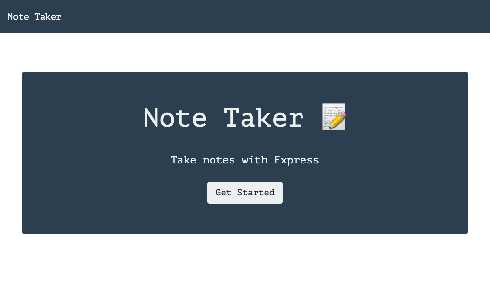
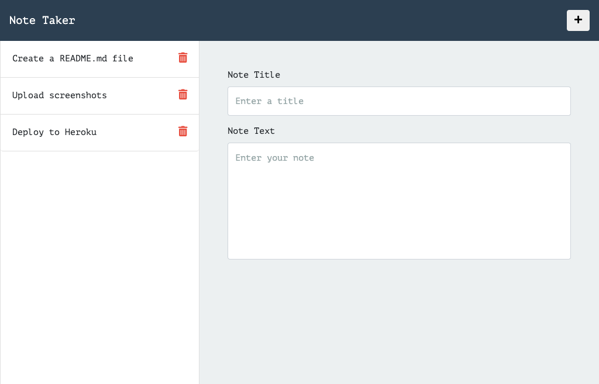

# Note Taker Application
  

  ## Description
  Note Taker can be used to write and save notes. This application uses an Express.js back end and saves and retrieves note data from a JSON file. Small business owners may want to be able to write and save notes to organize their thoughts and keep track of tasks they need to complete. This application uses Node.js, NPM, Express.js and JSON.

  ## Table of Contents
  * [Installation](#installation)
  * [Usage](#usage)
  * [License](#license)
  * [Contributing](#contributing)
  * [Tests](#tests)
  * [Questions](#questions)
  
  ## Installation
  To use the application, visit [Heroku](https://note-taker-ll.herokuapp.com/) To run this application locally, first clone the repository. Navigate inside the project folder. If you do not have Node.js or npm installed, you will first need to install them.
  [Install Node.js and npm](https://docs.npmjs.com/downloading-and-installing-node-js-and-npm)

  ## Usage
  Begin by entering a new note title and note text. Click on the save button to save this note. To continue entering notes, click on the add button. To load a saved note, click on it in the left panel. To delete a saved note, click on the trash can icon next to the note.

  :camera: 
  
  
  

  ## License
  Licensed under [MIT License](https://spdx.org/licenses/MIT.html).

  ## Contributing
  Anyone can participate in the project to submit bugs and make pull requests for anything from typos to new content.
  If you are interested in fixing issues and contributing to this project, please refer to the [Contributor Covenant](https://www.contributor-covenant.org/).

  ## Tests
  Currently no tests exists for the application. 
  If you would like to contribute and help us by writing them, see the [Contributing](#contributing) section.

  ## Questions
  For more information about me and my other projects, visit my [GitHub profile](https://github.com/LindseyJeeJan).
  Reach me to report issues or with questions at [ljjlauria@mac.com](mailto:ljjlauria@mac.com).
